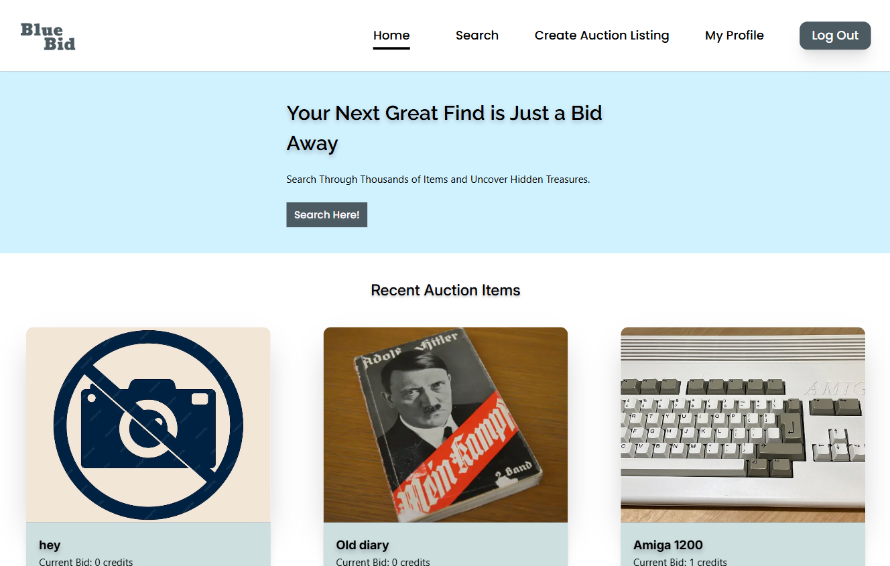

# Semester Project 2: Auction Website

## Overview
This project is my submission for the Semester Project 2 at my Front-end Development studies at Noroff. The project shows the skills learned over three semesters, aimed at developing a front-end auction website. The website allows users to register, create auction listings, and bid on items using a credit-based system. The application communicates with an existing API to handle auction-related data.

## Goal
Create a functional, user-friendly front-end auction website that integrates with the Noroff API to manage auction listings, bidding, and user accounts.

## Features
### For Registered Users:

- Registration: Users with a stud.noroff.no email address can register for the platform.
- Login and Logout: Users can securely log in and out of their accounts.
- Update Profile: Users can update their avatar to personalize their profile.

- Credits Management:
New users start with 1000 credits.
Credits can be earned by selling items and spent by bidding on or purchasing items.

- Create Listings:
Add a title, deadline, description, and media gallery for an auction.

- Bid on Listings:
Place bids on other users' active listings.

- View Bids:
See the bids placed on a specific listing.

### For Unregistered Users:

- Search Listings: Browse and search through available auction listings without registering.

## Technologies Used
HTML5: Structure and semantics
Tailwind CSS: Styling and responsive design
JavaScript: Dynamic behavior and API integration
Noroff API: Back-end data management

## Technical Requirements
Front-End Only: The application focuses solely on the front-end, utilizing the Noroff API for all back-end functionality.
Responsive Design: The website should be accessible and user-friendly on all devices.

## Getting Started
### Installation

Clone the repository:

git clone <https://github.com/TheRegzi/bluebid>

Navigate to the project directory:

cd bluebid

Install dependencies:

npm install

Start the development server:

npm start

## Deployment
The project is hosted on a static server. Visit the application at: https://bluebid.netlify.app/